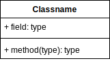

## Principles

Write tests first
- Writing your tests first helps to prevent **over-engineering** a solution and provides a suite or regression tests to prevent breaking existing functionality.

Refactoring
- "The freedom to refactor with impunity is made possible by unit testing. Together, unit testing and refactoring form a mutually beneficial relationship, whereby unit testing enables refactoring and refactoring improves the design of code" - Gary McLean Hall

TDD
- Development **driven** by tests producing just enough design.
- *Overengineering* occurs when code is made pointlessly adaptive - that is, it can be extended in ways that it will never need.
- Without becoming a domain expert in the field, you need a design tool that will guide you through the process of capturing labyrinthine requirements in working, verified code.
- Class, responsability, and collaboration (CSC) design sessions.

### Testing pyramid

* Manual tests
* * Acceptance tests (UI automation)
* * * Integration tests (black box)
* * * * Unit tests

Hourglass - When it has too many integration and acceptance tests, code is difficult to change.

Snowcone - When the majority of testing effort is manual, this indicates that you have an untestable codebase.

### Testing Quadrant (Gojko Adzic)
https://gojko.net/2013/10/21/lets-break-the-agile-testing-quadrants/

## Patterns

### Builder pattern

- Clarifies unit test intent, functional domain-specific language (DSL) 
- Reduces repetitive setup code

Reference: Adaptive Code - Gary McLean Hall

